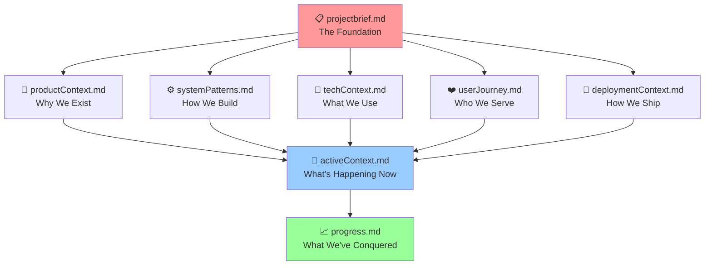

# 🧠 Memory Bank: Your Project's Digital Brain

> *Because AI memory resets, but your project genius shouldn't.*

## 🎯 What This Actually Is

Think of this as your project's **digital brain** - a living, breathing knowledge base that captures everything learned, decided, and discovered about Fridays at Four. While AI assistants forget everything between sessions, this Memory Bank **remembers it all**.

**The Magic**: Load these files into any new AI session and instantly get a co-pilot who knows your entire project history, user insights, and technical decisions.

## 🗺️ The Memory Bank Universe



## 🏗️ Your Memory Bank Arsenal

### 📋 [projectbrief.md](./projectbrief.md)
**The Genesis Document** - Where it all began
- 🎯 Project mission & north star goals
- 👥 Who we're building for & how we measure success
- 🏗️ Technical constraints that shape our world
- ✅ What's in scope (and what's definitely not)
- 💎 Quality standards we refuse to compromise on

### 🎨 [productContext.md](./productContext.md)
**The "Why We're Not Just Another App"** 
- 💔 The pain points that keep our users up at night
- ✨ Our solution vision (spoiler: it's not just another productivity tool)
- 🛣️ The user journey from "frustrated creative" to "project completion hero"
- 🏆 How we define success (hint: it's not just downloads)

### 🔧 [techContext.md](./techContext.md)
**The Technical Foundation** - Your setup survival guide
- 🏗️ Backend + frontend architecture that actually works
- 🚀 Setup instructions that won't make you cry
- 💾 Database schema + API endpoints mapped out
- 📦 Dependencies and constraints (the good, bad, and necessary)

### ⚙️ [systemPatterns.md](./systemPatterns.md)
**The "How We Actually Build Things"** - Battle-tested patterns
- 🧩 Design patterns that save your sanity
- 🔄 Data flow that makes sense
- 🎯 Technical decisions (and why we made them)
- ⚡ Performance patterns that keep things snappy

### ❤️ [userJourney.md](./userJourney.md)
**The Human Story** - Meet Sarah & Emma, our creative heroes
- 👤 Detailed user profiles (these aren't generic personas)
- 🎢 Emotional journey from skepticism to creative empowerment
- ✨ Magic moments that make users fall in love with the product
- ⚠️ Exit points where we could lose them (and how to prevent it)

### 🚀 [deploymentContext.md](./deploymentContext.md)
**The "Ship It" Playbook** - From code to production without tears
- 🔄 Development workflows that actually work
- 🤖 CI/CD pipelines explained for humans
- 🔧 Environment management (secrets, configs, the works)
- 🛠️ Troubleshooting guide for when things go sideways

### 🎪 [activeContext.md](./activeContext.md)
**The "What's Happening Right Now"** - Your project pulse
- 🔥 Current focus and burning priorities
- 🆕 Recent changes that matter
- 💭 Active decisions being wrestled with
- 📍 Where we are in the grand journey

### 📈 [progress.md](./progress.md)
**The Victory Tracker** - Celebrating what works, planning what's next
- ✅ Production-ready features (the stuff that actually works)
- 🔮 Future development dreams
- 🏆 Milestones conquered
- 🐛 Known issues (because transparency is cool)

## 🎮 How to Use This Beast

### 🤖 For AI Sessions
1. **🔥 Start EVERY session** by reading ALL Memory Bank files
2. **📋 Begin with projectbrief.md** - get your bearings
3. **🎪 Check activeContext.md** - what's the current vibe?
4. **📈 Review progress.md** - celebrate recent wins
5. **❤️ Reference userJourney.md** - never forget who we serve
6. **🚀 Consult deploymentContext.md** - when it's time to ship
7. **🔄 Update files** when you learn something new

### 🤖⚡ AI Auto-Update Magic
**🚨 ATTENTION AI ASSISTANTS: You're not just a code monkey, you're a Memory Bank guardian!**

#### 🎯 When to Auto-Update (No Excuses Edition):
- **🎉 Feature ships to production** → Update `progress.md` (move that victory!)
- **🚀 Something gets deployed** → Update `activeContext.md` status
- **💡 New pattern discovered** → Add to `systemPatterns.md`
- **🏗️ Architecture evolves** → Update `techContext.md` & `systemPatterns.md`
- **❤️ User insights emerge** → Enhance `userJourney.md`
- **🔧 Workflow changes** → Update `deploymentContext.md`

#### 🎭 The Auto-Update Dance:
1. **🎉 Feature goes live**: Move it from "Future Dreams" to "Production Reality" in `progress.md`
2. **🎯 Focus shifts**: Update `activeContext.md` with the new mission
3. **🧩 Pattern emerges**: Document it in `systemPatterns.md` for future heroes
4. **👥 User research happens**: Weave insights into `userJourney.md`
5. **🚀 Process improves**: Capture it in `deploymentContext.md`

#### 🎨 Update Format (Make it Sing):
```
🎉 Memory Bank Auto-Update: [What happened]
- 📝 Updated: [filename]
- ✨ Change: [what got better]
- 🚀 Impact: [how this helps the project soar]
```

#### ✅ Quality Check (Don't Ship Broken Dreams):
- [ ] `activeContext.md` reflects reality (not wishful thinking)
- [ ] `progress.md` celebrates latest victories
- [ ] File relationships still make sense
- [ ] New information enhances rather than confuses

**🔥 Remember: A stale Memory Bank is like a broken compass - worse than useless!**

## 🕸️ How Files Connect (The Web of Knowledge)

- **📋 projectbrief.md** → The sun around which everything orbits
- **🎨🔧⚙️❤️🚀** → The foundation files that build the universe
- **🎪 activeContext.md** → The lens that focuses all foundation knowledge
- **📈 progress.md** → The scoreboard tracking implementation reality

## 🎯 Current Project Pulse

### 🚀 Status: PRODUCTION READY & MEMORY BANK POWERED ✅
- **Backend**: 49/49 tests passing (because we're perfectionists)
- **Onboarding**: 8-topic flow that users actually complete
- **Database**: Auto-dependency creation (no more foreign key tears)
- **Testing**: Automated everything (robots testing robots)
- **Documentation**: This beautiful Memory Bank system you're reading
- **User Intelligence**: Sarah & Emma's stories captured for all time
- **Deployment**: CI/CD workflows documented for humans

### 🎯 Next Adventure
Frontend integration with Memory Bank intelligence - time to make the UI as smart as the backend!

## 🎪 Benefits of This System

### 🧠 Knowledge Immortality
- Context never dies between AI sessions
- Project evolution tracked like a time machine
- Decision history preserved for future generations

### 🚀 Collaboration Superpowers
- New team members onboard in minutes, not weeks
- Every AI session starts with full context
- Structured knowledge beats scattered notes every time

### 💎 Quality Assurance Magic
- Complete project health visibility
- Clear tracking of "works" vs "needs work"
- User journey validation against implementation

---

*🎯 The Memory Bank: Where project knowledge goes to live forever, not die in forgotten chat logs.* 